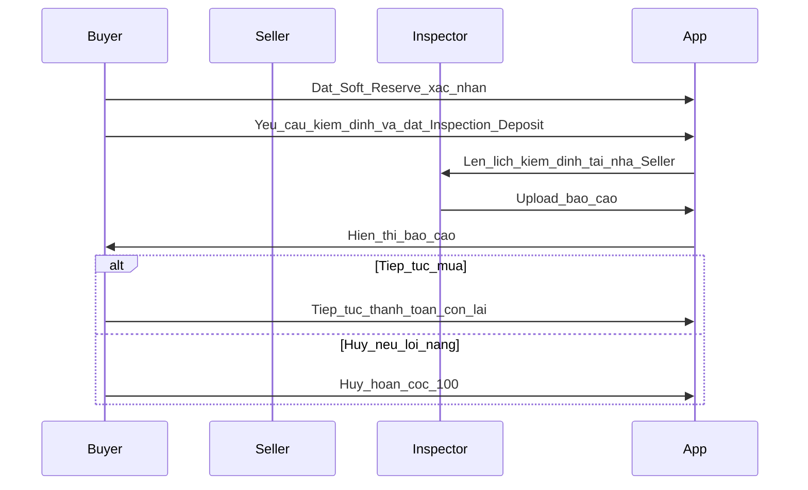

# Quy tắc nghiệp vụ: Đặt cọc, kiểm định, hoàn tất đơn

Tài liệu cố định luồng **tiền + trạng thái** (đồng bộ với [03-platform-policy.md](./03-platform-policy.md)). Phạm vi địa lý & phí nền tảng xem **mục A** trong file 03.

## 1. Định nghĩa

| Khái niệm | Định nghĩa |
|-----------|------------|
| **Đặt cọc 2 lớp** | Buyer đi qua 2 bước: **Soft Reserve** (giữ chỗ nhẹ) trước, sau đó mới **Inspection Deposit** khi xác nhận yêu cầu kiểm định. |
| **Soft Reserve (Lớp 1)** | Cọc nhẹ **200.000đ - 500.000đ** (config Admin, fixed theo gói), dùng để giữ chỗ listing, mở chat và mở PII theo policy. |
| **Inspection Deposit (Lớp 2)** | Cọc kiểm định thu khi Buyer bấm **Yêu cầu kiểm định**: `min(rate_inspection × giá niêm yết, 2.000.000 VND)` với `rate_inspection` cấu hình trong khoảng **5%-10%**. |
| **Giữ chỗ** | Listing → `reserved`; không nhận Buyer khác cho cùng listing. |
| **Đặt mua (full)** | Vẫn có thể hỗ trợ sau; hoàn tất đơn áp dụng **cùng quy tắc mục 4** (xác nhận nhận hàng / logistics + 48h). |
| **SLA** | Thời hạn xử lý nội bộ hoặc cam kết với user (khác SLA khiếu nại trong file 03). |

## 2. Trạng thái Listing liên quan giao dịch

1. `published` — đang rao.
2. `reserved` — Soft Reserve đã xác nhận, đang trong luồng kiểm định / mua.
3. `sold` — giao dịch hoàn tất.
4. `withdrawn` — seller ẩn/gỡ (theo quyền; có thể bị chặn khi tranh chấp).

**Quy tắc:** Một listing chỉ **một** giao dịch cọc/mua **active** tại một thời điểm.

**Khóa chỉnh sửa:** Khi có Order active, hệ thống **chặn** Seller sửa giá/spec **material**; mọi thay đổi lớn khi không có đơn vẫn kích hoạt **duyệt lại** theo [03-platform-policy.md](./03-platform-policy.md) mục C.2.

## 3. Mô hình cọc 2 lớp — thanh toán phần còn lại (gợi ý vận hành)

| Tham số | Giá trị (đã chốt / gợi ý) |
|---------|----------------------------|
| Soft Reserve (Lớp 1) | **200.000đ - 500.000đ** (config theo gói, fixed tại thời điểm tạo order) |
| Inspection Deposit (Lớp 2) | `min(rate_inspection × giá xe, 2.000.000đ)` với `rate_inspection` trong khoảng **5%-10%** |
| Điều kiện thu lớp 2 | Buyer bấm **Yêu cầu kiểm định** (không thu lớp 2 ngay ở bước browse/quan tâm) |
| Sau kiểm định — Buyer **Tiếp tục mua** | Thanh toán **phần còn lại** theo hạn SLA (cấu hình Admin, ví dụ 72h) kể từ khi báo cáo được chấp nhận / nút “Tiếp tục”. |
| Gia hạn | Tối đa **1 lần**, **24h**, cần đồng ý đôi bên (ghi audit). |

**Nguyên tắc tính phần còn lại:**

- Nếu giao dịch đi tiếp: phần còn lại = giá niêm yết - số tiền đã thu và được ghi nhận vào giao dịch (inspection deposit và các khoản được cấu hình khấu trừ).
- Soft Reserve được xử lý theo ma trận fault ở mục 7, không mặc định coi là khoản trả trước cho giá xe nếu chưa có rule kế toán riêng.

## 4. Hoàn tất giao dịch (Order → `completed`)

State machine giao nhận/hoàn tất áp dụng chuẩn:

`delivered` → `pending_confirmation` → (`completed` bởi Buyer xác nhận hoặc auto-confirm)

Đơn chuyển **`completed`** khi **một trong hai** điều kiện xảy ra trong trạng thái `pending_confirmation`:

1. Buyer nhấn **“Đã nhận hàng”**; hoặc  
2. **48 giờ** kể từ thời điểm logistics (hoặc trạng thái vận chuyển nội bộ) báo **“Giao thành công”** / tương đương **mà không có khiếu nại** đang mở trên đơn.

**Nhắc việc và escalation vận hành:**

- Nhắc Buyer ở mốc 24h và 47h khi còn ở `pending_confirmation`.
- Nếu đang có khiếu nại mở, không auto-complete; giữ trạng thái theo luồng tranh chấp.

Sau `completed`: áp dụng **phí thành công 2–3%** (file 03), mở cửa sổ **đánh giá**, listing → `sold`.

## 5. Kịch bản kiểm định chuẩn (MVP: on-demand sau cọc lớp 2)

1. Buyer **đặt Soft Reserve** (đã xác nhận) để giữ chỗ; khi Buyer bấm **Yêu cầu kiểm định** và đóng **Inspection Deposit** thì hệ thống kích hoạt lịch **Inspector đến nhà Seller** kiểm tra.  
2. Inspector **upload báo cáo** lên App (checklist + ảnh/PDF).  
3. Buyer đọc báo cáo → **Tiếp tục mua** (thanh toán phần còn lại + giao nhận theo quy trình) **hoặc** **Hủy**.  
4. **Hủy với hoàn cọc 100% (cả 2 lớp):** khi báo cáo kết luận **lỗi nặng hơn mô tả** (vd nứt khung, hàng giả, sai lệch nghiêm trọng so với tin đăng) — Admin có thể override nếu tranh chấp.

## 6. Phí kiểm định — ai trả

| Kết quả kiểm định | Người trả phí kiểm định |
|-------------------|-------------------------|
| Xe **đúng / phù hợp** mô tả (trong ngưỡng chấp nhận) | **Buyer** |
| Xe **sai lệch nghiêm trọng** (vd nứt khung, hàng giả, không thể hiện đúng trên tin) | **Seller** — thu qua **trừ ví Seller** hoặc **trừ từ tiền cọc** / bù trừ sau hoàn cọc (cấu hình kế toán nội bộ). |

## 7. Hủy kèo & phân bổ cọc

### 7.0 Fault detection logic (nền tảng cho phân bổ)

- Mọi quyết định phân bổ cọc dùng mã lỗi chuẩn (`fault_code`) và bằng chứng: chat, log hẹn, trạng thái logistics, báo cáo Inspector, chứng từ thanh toán.
- Bộ mã tối thiểu: `buyer_no_fault_cancel`, `buyer_no_show`, `seller_fault`, `severe_mismatch`, `system_fault`, `force_majeure`.
- Khi chưa xác định được lỗi: tạm khóa chi trả và chuyển tranh chấp (mục 7.4).

### 7.1 Buyer hủy kèo

- **Case A - Buyer hủy, không có lỗi từ Seller/xe (`buyer_no_fault_cancel`):**
  - Nếu chưa yêu cầu kiểm định lớp 2: mất Soft Reserve, phân bổ **70% Seller / 30% Sàn**.
- **Case B - Buyer no-show hoặc không hoàn tất bước đã cam kết (`buyer_no_show`):**
  - Mất các khoản cọc đã thu, phân bổ **80% Seller / 20% Sàn**.
- **Case C - Lỗi hệ thống (`system_fault`):** hoàn **100%** các khoản đã thu cho Buyer.

### 7.2 Seller hủy kèo

- **Hậu quả:** **Hoàn 100% toàn bộ khoản cọc đã thu (lớp 1 + lớp 2 nếu có)** cho Buyer.  
- **Kỷ luật Seller:** **đánh dấu uy tín (tương đương 1 sao / cảnh báo)** **hoặc** **phạt tiền** trừ **ví Seller** (khi module ví đã có). Có thể áp dụng đồng thời tùy mức độ vi phạm (bảng Admin).

### 7.3 Hết hạn thanh toán phần còn lại (sau khi chọn tiếp tục mua)

- Nếu Buyer **không thanh toán phần còn lại** trong SLA sau khi bấm **Tiếp tục mua**: mặc định coi là `buyer_no_show` — áp dụng **mục 7.1 / Case B** (80% Seller / 20% Sàn), trừ khi Admin bật chính sách ngoại lệ (ghi trong điều khoản).
- Listing: đề xuất quay **`published`** sau khi xử lý xong phân bổ cọc.

### 7.4 Tranh chấp

- Đóng băng chi trả cho đến quyết định Admin; tham chiếu ma trận [03-platform-policy.md](./03-platform-policy.md) mục F.3.

## 8. SLA kiểm định (gợi vận hành — có thể config)

- **Phân công Inspector:** trong **24 giờ** làm việc sau khi **Inspection Deposit (lớp 2) xác nhận**.  
- **Hoàn thành báo cáo trên App:** trong **48 giờ** sau buổi kiểm tại nhà Seller (hoặc theo SLA nội bộ đã cam kết).

## 9. Audit

Mọi thay đổi `Order`, `Listing`, phân bổ cọc, quyết định hoàn: **actor**, **timestamp**, **lý do (enum)**, **attachment** (nếu có).

---

*Tài liệu này là đầu vào cho SRS (`Order`, `Payment`, `Inspection`) và cấu hình Admin (`FeeRule`).*
