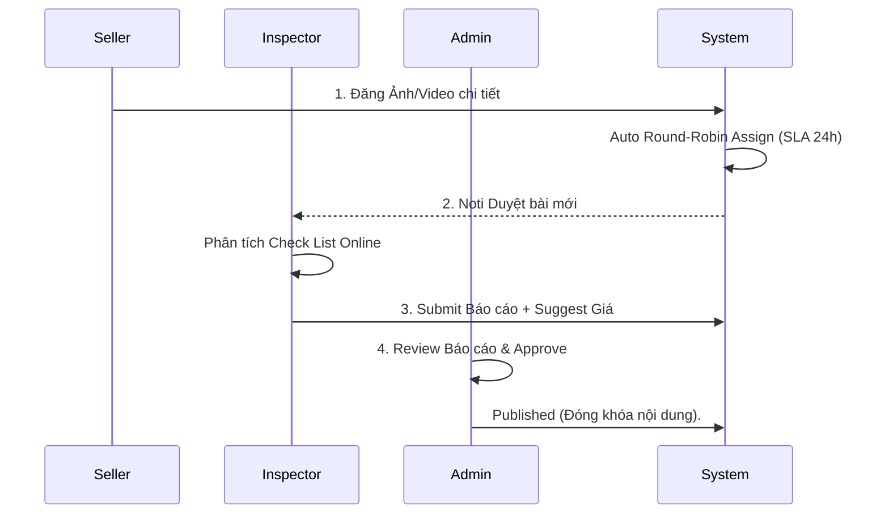
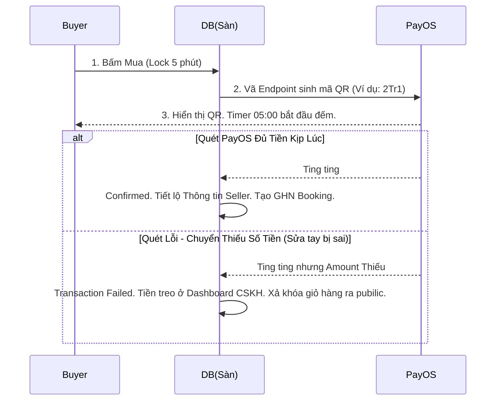
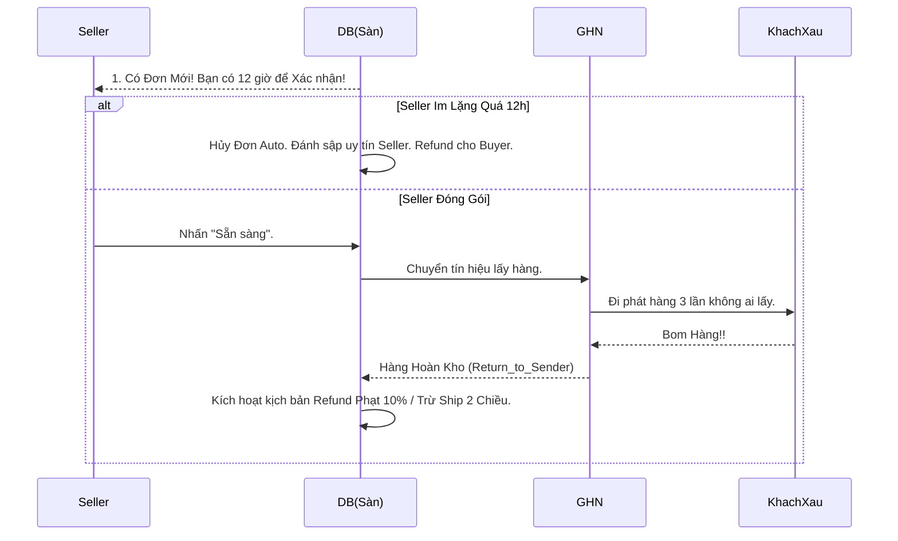

# Phân tích BA & Tech Lead — VeloTrust (Used Bicycle Exchange)

> **Dự án:** Online Exchange System for Used Sports Bicycles  
> **Phiên bản:** 3.2 (Bổ sung Chặn Rủi Ro: SLA, Bom Hàng, Lock Timeout)  
> **Phạm vi MVP:** HN, TP.HCM, Đà Nẵng  

---

## 1. Business Logic quan trọng

### A. Listing & Đăng tin

| # | Business Rule | Mức độ |
|---|--------------|--------|
| BL-L01 | Bắt buộc **số khung (serial)** và **≥1 ảnh truyền động** trước khi submit | 🔴 Critical |
| BL-L02 | BẮT BUỘC toàn bộ bài đăng phải qua tay Inspector duyệt Online trước khi Admin duyệt xuất bản | 🔴 Critical |
| BL-L03 | Một listing **chỉ 1 giao dịch active** (Hoặc đang khóa cart 5 phút, hoặc đã bán) | 🔴 Critical |
| BL-L04 | Giải ngân: Seller BẮT BUỘC phải điền **Tài Khoản Ngân Hàng** trong Profile thì mới được đăng bán, hoặc mới được nhận Payout tự động. | 🔴 Critical |

### B. Mua Hàng Trực Tiếp (Cart Lock 5 Phút)

| # | Business Rule | Mức độ |
|---|--------------|--------|
| BL-D01 | **Lock 5 Phút:** Khi click mua, listing bị khóa. Hết 5 phút không quét mã nhả về `published`. | 🔴 Critical |
| BL-D02 | Hệ thống gọi trực tiếp Live API GHN. | 🔴 Critical |
| BL-D03 | Quét QR PayOS: Nếu Số Tiền Nhận Được `<` Giá Niêm Yết. Đánh dấu `Failed Paid`. Nhờ CSKH trả tay, tự động xả giỏ hàng. | 🔴 Critical |
| BL-D04 | Toàn bộ tiền cất vào Escrow nền tảng giữ chờ 48h từ khi báo Delivery mới Auto Bank Transfer cho Seller. | 🔴 Critical |

### C. Hủy kèo & Phân bổ Rủi Ro (Penalty Matrix)

| # | Kịch bản | Phân bổ Phạt & Hoàn Tiền |
|---|----------|---------------------------|
| C1 | **SLA Seller (Bom Đơn):** Quá 12 tiếng không xác nhận chuẩn bị đơn. | Hoàn đủ 100%. Phạt chết người bán. |
| C2 | **Buyer Hủy Lúc Chưa Giao Hàng:** Seller chưa ship. | Buyer mất **5%** Giá Niêm Yết. Hoàn phí ship lại cho Buyer. |
| C3 | **Buyer Bom Hàng (GHN Returned):** Gọi không nghe máy. | Buyer bị Phạt **10% Giá Niêm Yết** HOẶC Giá Trị **Tiền Ship 2 Chiều** (Cái nào lớn hơn thì lấy), trừ tiền đền lại cho Seller. |
| C4 | **SLA Khiếu Nại (Dispute):** Khách tố xe hư xe lỏ. | Bắt buộc up Video Unbox trong 24h. Không up -> Xử thua lập tức. |

### D. Kiểm định (Inspector 100% Online)

| # | Business Rule | Mức độ |
|---|--------------|--------|
| BL-I01 | Mô hình Desk-Review. Hệ thống **tự động Auto-Assign** chia đều task cho Inspector xử lý trong 24h. | 🔴 Critical |
| BL-I02 | Trả báo cáo: Có nứt khung không? Có mòn cụm phanh không? Tham mưu giá hợp lý là bao nhiêu? | 🟡 High |
| BL-I03 | Cấn trừ 100.000đ khi hoàn tất Payout. | 🟡 High |

---

## 2. Core Flow — Step-by-step

### Flow 1: Đăng tin & Auto Assign Inspector

### Flow 2: Đặt Mua & Giải quyết lỗi PayOS

### Flow 3: Vận chuyển SLA 12 Tiếng (Dành cho Seller)

---

## 3. Chức năng hệ thống (API / DB Mapping Bổ Sung Cốt Lõi)

- **SellerProfile Bổ Sung Mới:** Thêm cột `bank_account_name`, `bank_account_number`, `bank_name` để thực thi giải ngân Auto-Disburse 48h.
- **Inspector Bổ Sung Logic:** Phân luồng auto assign (VD lấy user admin rảnh rỗi hoặc có task queue nhỏ nhất).
- **Dispute Logic Bổ Sung:** Table `dispute` thêm cột `time_limit` 24h, phải có cờ `has_media_proof`.

---
*Phiên bản 3.2 — Vá Lỗ Hổng Edge Cases — 2026-04-20*
