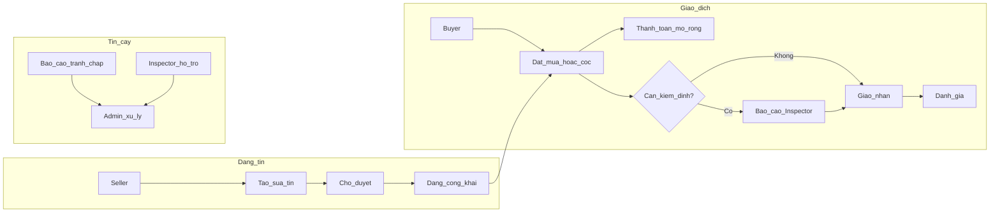

# Phân tích nghiệp vụ: Online Exchange System for Used Sports Bicycles

## 1. Bối cảnh và vấn đề

**Bối cảnh:** Nhu cầu tập luyện, sức khỏe và xe đạp thể thao tại đô thị tăng; thị trường mới/cũ phát triển nhưng **phân mảnh**, thiếu chuyên nghiệp.

**Vấn đề cốt lõi:**

- Giao dịch chủ yếu qua **MXH / rao vặt tổng quát** → rủi ro thông tin, chất lượng, độ tin cậy.
- Thiếu **tiêu chí kỹ thuật** và **minh bạch** (khó kiểm chứng).
- Thiếu **cơ chế tin cậy** (uy tín người bán, xác minh sản phẩm, an toàn giao dịch, kết nối đúng đối tượng).

**Mục tiêu hệ thống:** Nền tảng **chuyên biệt**, vai trò **cầu nối** giữa người mua và người bán, **minh bạch – an toàn – bền vững** cho cá nhân và cửa hàng.

---

## 2. Tác nhân (actors)

| Tác nhân      | Mô tả ngắn                                                                                  |
| ------------- | ------------------------------------------------------------------------------------------- |
| **Guest**     | Xem công khai (danh mục, chi tiết theo chính sách), chưa đăng nhập.                         |
| **Buyer**     | Đăng ký/đăng nhập, tìm kiếm, đặt mua/cọc, đánh giá, wishlist.                               |
| **Seller**    | Đăng quản lý tin, đơn/cọc, uy tín/đánh giá.                                                 |
| **Inspector** | Kiểm định kỹ thuật, gắn nhãn, báo cáo, hỗ trợ tranh chấp (thuộc hệ thống).                  |
| **Admin**     | Người dùng, duyệt tin, vi phạm/tranh chấp, danh mục/thương hiệu, giao dịch & phí, thống kê. |

**Ghi chú thiết kế:** Inspector là vai **nội bộ/nền tảng** — cần quy trình phân công, SLA kiểm định, và phân quyền tách biệt Admin (vận hành) vs Inspector (chuyên môn).

---

## 3. Quy trình nghiệp vụ chính (luồng tóm tắt)

**Luồng cần làm rõ khi triển khai (để tránh mơ hồ):**

- **Đặt mua vs đặt cọc:** Quy tắc hoàn/hủy, giữ chỗ, hết hạn cọc, chuyển trạng thái sang “đã bán”.
- **Kiểm định:** Bắt buộc hay tùy chọn? Ai trả phí? Thứ tự: trước cọc hay sau?
- **Tranh chấp:** Tiếp nhận từ Buyer/Seller, Inspector có quyền chứng nhận tình trạng thực tế; Admin quyết định theo chính sách.

---

## 4. Chức năng theo vai trò (mapping yêu cầu)

**Seller**

- CRUD tin bán: ảnh, video, mô tả chi tiết (nên chuẩn hóa: loại xe, hãng, size khung, groupset, tình trạng…).
- Quản lý trạng thái tin: sửa, ẩn, xóa.
- Quản lý **đơn đặt mua / đặt cọc** (theo dõi trạng thái).
- Xem **đánh giá/uy tín** (tổng hợp điểm, số giao dịch).

**Buyer**

- Đăng ký / đăng nhập.
- Tìm kiếm & lọc: loại, giá, hãng, size khung, tình trạng; (mở rộng: khoảng cách nếu có địa điểm).
- Chi tiết: ảnh, mô tả, **lịch sử sử dụng** (nếu có), trạng thái kiểm định.
- Đặt mua / đặt cọc; đánh giá sau giao dịch; **wishlist**.

**Inspector**

- Kiểm tra khung, phanh, truyền động (checklist có thể cấu hình).
- Gắn nhãn **“Xe đã kiểm định”** + metadata (ngày, phiên bản tiêu chuẩn).
- Upload **báo cáo kiểm định** (PDF/ảnh).
- Hỗ trợ xử lý tranh chấp (ý kiến chuyên môn, không nhất thiết quyết định cuối).

**Admin**

- Quản lý user (Buyer/Seller): khóa/mở, xác minh (nếu có).
- **Kiểm duyệt tin** đăng.
- Xử lý **báo cáo vi phạm / tranh chấp**.
- **Danh mục** (taxonomy xe đạp thể thao), **thương hiệu**.
- Quản lý **giao dịch & phí dịch vụ** (hoa hồng, phí niêm yết, phí kiểm định).
- **Thống kê & báo cáo** (GMV, tỷ lệ duyệt, tranh chấp, thời gian kiểm định).

**Guest**

- Xem danh sách/chi tiết theo chính sách (một số trường có thể ẩn đến khi đăng nhập: SĐT, địa chỉ giao).

---

## 5. Thực thể dữ liệu gợi ý (để làm SRS/ERD sau)

- `User`, `SellerProfile`, `BuyerProfile`
- `Listing` (tin), `ListingMedia`, `ListingSpecs` (thông số kỹ thuật chuẩn)
- `Brand`, `Category`, `FrameSize` (hoặc enum/config)
- `Order` / `Reservation` (đặt mua vs cọc), `OrderStatus`, `Payment` (khi mở rộng)
- `Inspection`, `InspectionReport`, `InspectionCertificate` (liên kết Listing)
- `Review` (sau giao dịch), `ReputationScore`
- `Wishlist`, `Report`, `Dispute`, `AdminAction`, `FeeRule`

---

## 6. Mở rộng (theo đề xuất của bạn)

| Hạng mục              | Giá trị nghiệp vụ                           | Ghi chú tích hợp                                                                    |
| --------------------- | ------------------------------------------- | ----------------------------------------------------------------------------------- |
| **Chatbot CSKH**      | Giảm tải hỏi đáp, hướng dẫn đăng tin/lọc xe | FAQ + escalation sang ticket; không thay thế tranh chấp pháp lý.                    |
| **Logistics**         | Giao nhận có tracking                       | Đối tác vận chuyển, địa chỉ lấy/giao, phí ship; đồng bộ trạng thái với đơn.         |
| **Thanh toán online** | Cọc/thanh toán an toàn                      | Ví escrow (giữ tiền đến khi xác nhận nhận xe) phù hợp mục tiêu “an toàn giao dịch”. |

**Thứ tự ưu tiên gợi ý:** (1) Luồng đặt mua/cọc + uy tín/đánh giá + duyệt tin + kiểm định cốt lõi → (2) Thanh toán/escrow → (3) Logistics → (4) Chatbot.

---

## 7. Rủi ro và kiểm soát

- **Thông tin sai lệch:** Duyệt tin + tiêu chí bắt buộc + kiểm định tùy/bắt buộc theo gói.
- **Gian lận thanh toán / nhận hàng:** Escrow, bằng chứng giao (ảnh, chữ ký điện tử đơn giản), SLA tranh chấp.
- **Phụ thuộc Inspector:** Quy trình SLA, nhiều inspector, tiêu chuẩn kiểm định thống nhất.

---

## 8. Deliverable tiếp theo (khi chuyển sang triển khai)

- **BRD/SRS** chi tiết: quy tắc trạng thái đơn/cọc, ma trận phân quyền, wireframe luồng chính.
- **ERD** và API boundary (nếu làm web/mobile riêng).
- **MVP scope:** nên giới hạn vai trò + 1–2 luồng thanh toán (hoặc offline trước) để ra thị trường sớm.

---

Nếu bạn muốn bước tiếp theo là **SRS chi tiết** (trạng thái đơn, cọc, kiểm định) hoặc **ERD/API**, nêu rõ stack (ví dụ web-only, hay web + app) và mô hình kiểm định (bắt buộc/tùy chọn) để chi tiết hóa cho đúng nghiệp vụ.